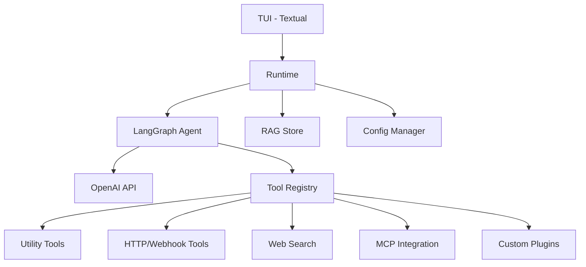

# LangGraph Terminal UI

[](https://www.python.org/downloads/)
[](LICENSE)
[](https://python.langchain.com/)
[](https://langchain-ai.github.io/langgraph/)

> Uma interface de terminal moderna e poderosa para conversar com modelos de IA, integrar ferramentas externas e manter uma base de conhecimento local com RAG.

---

## 🚀 O que é e Como Começar

### O que é este projeto?

O **LangGraph Terminal UI** é um aplicativo de terminal (TUI) que combina as melhores ferramentas de IA em uma interface simples e eficiente. Com ele você pode:

- 💬 Conversar com modelos da OpenAI
- 🔍 Indexar documentos locais e fazer perguntas sobre eles (RAG)
- 🔧 Integrar APIs, webhooks e serviços externos
- 🧠 Salvar memórias de contexto para conversas futuras
- 📝 Criar plugins personalizados para expandir funcionalidades

**Perfeito para:** Desenvolvedores, analistas, estudantes e qualquer um que precisa de uma assistente de IA potente e configurável no terminal.

### Pré-requisitos

- **Python 3.12+** (recomendado: 3.12.10)
- **Chave da API OpenAI** ([obtenha aqui](https://platform.openai.com/api-keys))
- **Windows PowerShell** (para scripts de execução)

### Instalação Rápida (3 passos)

#### 1️⃣ Clone o repositório

```bash
git clone https://github.com/seu-usuario/langgraph-terminal-ui.git
cd langgraph-terminal-ui
```

#### 2️⃣ Crie o ambiente virtual

```powershell
py -3.12 -m venv .venv312
.venv312\Scripts\python.exe -m pip install -e .
```

#### 3️⃣ Configure a chave da OpenAI

**Opção A - Durante o uso:**

Execute o aplicativo e digite `/key sk-sua-chave-aqui`

**Opção B - Via arquivo `.env`:**

```powershell
# O script run.ps1 cria automaticamente o .env se não existir
cp .env.example .env
# Edite o arquivo .env e adicione sua chave
```

### Primeiro Uso

Execute o aplicativo:

```powershell
# Em inglês
.\run.ps1

# Ou em português
.\iniciar.ps1

# Ou use o atalho em batch
.\iniciar.cmd
```

### Comandos Essenciais

Dentro do terminal, digite `/help` para ver todos os comandos. Aqui estão os principais:

| Comando | Descrição |
|---------|-----------|
| `/help` | Mostra ajuda completa |
| `/status` | Ver status da aplicação |
| `/key <chave>` | Define chave da OpenAI |
| `/model <nome>` | Define modelo (ex: gpt-4.1-mini) |
| `/add-doc "arquivo"` | Indexa documento para RAG |
| `/list-docs` | Lista documentos indexados |
| `/new` | Inicia nova conversa |
| `/quit` | Sai do aplicativo |

### Exemplos Práticos

#### Exemplo 1 - Chat Simples

```
Você: Explique o que é LangGraph
Assistant: [resposta detalhada]
```

#### Exemplo 2 - Consultar Documentos

```powershell
# Indexe alguns arquivos
/add-doc "README.md"
/add-doc "pyproject.toml"
/list-docs

# Faça perguntas sobre eles
Você: Quais dependências tem este projeto?
Assistant: [resposta baseada nos documentos indexados]
```

#### Exemplo 3 - Configuração Avançada

```
/model gpt-4.1-turbo
/temperature 0.7
/reasoning high
/max-rag 10
```

### Como Finalizar

```powershell
# Em inglês
.\stop.ps1

# Ou em português
.\finalizar.ps1

# Ou o atalho
.\finalizar.cmd
```

---

## 🛠️ Detalhes Técnicos

### Arquitetura do Projeto

O projeto é construído sobre uma arquitetura modular e extensível:



### Componentes Principais

#### 1. **Terminal UI (TUI)**
- **Framework:** [Textual](https://textual.textual.io/) 0.58.1+
- Interface moderna com suporte a cores, autocompletar e atalhos
- Layout responsivo com chat e sidebar de informações

#### 2. **LangGraph Agent**
- **Framework:** [LangGraph](https://langchain-ai.github.io/langgraph/) 0.2.35+
- Orquestração de ferramentas com controle de fluxo
- Gerenciamento de sessões e contexto de conversa
- Integração com LangChain para abstrações de modelo

#### 3. **RAG (Retrieval-Augmented Generation)**
- **Base Vetorial:** JSON local (`rag_index.json`)
- **Embeddings:** OpenAI (text-embedding-3-small)
- **Busca Híbrida:** Vetorial + Lexical (BM25)
- **Chunking Inteligente:** Preserva contexto e significado
- **Filtros:** Suporte a exclusão de fontes e limiar de confiança

#### 4. **Sistema de Memória**
- Armazenamento automático de fatos relevantes
- Consulta semântica de memórias anteriores
- Políticas configuráveis: `strict`, `balanced`, `off`
- Detecção automática de credenciais para segurança

#### 5. **Tool Registry**
- Arquitetura de plugins extensível
- Provedores embutidos:
  - **Utility**: Operações básicas
  - **RAG**: Busca em conhecimento local
  - **HTTP API**: Requisições REST
  - **Webhook**: Envio de eventos
  - **Web Search**: Busca web (DuckDuckGo)
  - **MCP**: Integração com Model Context Protocol
- Customização via `plugins/*.py`

### Estrutura de Arquivos

```
langgraph-terminal-ui/
├── src/
│   └── langgraph_terminal/
│       ├── main.py              # Ponto de entrada
│       ├── runtime.py           # Coordenação geral
│       ├── config.py            # Gerenciamento de configuração
│       ├── tui.py               # Interface de terminal
│       ├── reasoning.py         # Controle de esforço de raciocínio
│       ├── graph/               # LangGraph agent
│       │   ├── __init__.py
│       │   └── agent_service.py
│       ├── rag/                 # Sistema RAG
│       │   ├── __init__.py
│       │   └── store.py
│       └── tools/               # Ferramentas
│           ├── __init__.py
│           ├── contracts.py
│           ├── providers.py
│           └── registry.py
├── plugins/
│   └── example_provider.py     # Plugin de exemplo
├── tests/                       # Testes unitários
├── .gitignore
├── .env.example                 # Template de configuração
├── pyproject.toml               # Dependências Python
├── run.ps1                      # Script de execução
├── stop.ps1                     # Script de parada
├── iniciar.ps1                  # Script alternativo (PT-BR)
├── finalizar.ps1                # Script alternativo de parada (PT-BR)
└── README.md                    # Este arquivo
```

### Configuração

#### Variáveis de Ambiente

Todas as configurações podem ser definidas via `.env` ou comandos da TUI:

```bash
# OpenAI Configuration
OPENAI_API_KEY=sk-...
OPENAI_MODEL=gpt-4.1-mini
OPENAI_EMBEDDING_MODEL=text-embedding-3-small
OPENAI_REASONING_LEVEL=medium
OPENAI_TEMPERATURE=0.1

# RAG Configuration
MAX_RAG_RESULTS=4
RAG_MIN_FINAL_SCORE=0.18

# Webhook & HTTP
WEBHOOK_TIMEOUT_SECONDS=20
TOOL_HTTP_ALLOWLIST=api.example.com,webhook.example.com

# MCP Integration
MCP_GATEWAY_URL=http://localhost:8080

# Debugging & Tracing
TRACE_ENABLED=false
MEMORY_POLICY=balanced
```

#### Configuração Persistente

- Configurações são salvas em `.terminal_agent/config.json`
- Modificações via TUI são persistidas automaticamente
- Ao iniciar, configurações são recarregadas
- Chaves da API do ambiente são importadas se não existirem no config

### Funcionalidades Avançadas

#### Reasoning Control

Controle fino do esforço de raciocínio do modelo:

```text
/reasoning low     # Respostas rápidas, menos profundas
/reasoning medium  # Balanceado (padrão)
/reasoning high    # Respostas mais profundas
/reasoning xhigh   # Máximo esforço de raciocínio
```

**Modelos Suportados:**
- **Nativos:** gpt-5.*, o1*, o3*, o4* (controlam via parâmetro oficial)
- **Compatíveis:** gpt-4.*, gpt-3.5* (usam prompts de fallback)

#### Diagnóstico e Debug

```text
/trace on              # Ativa logging detalhado
/last-trace            # Mostra trace do último turno
/debug-doc "arquivo"   # Inspeção de extração/chunking
/debug-search "q" 10   # Análise de ranking híbrido
/debug-rag-answer "q"  # Contexto final entregue ao modelo
```

#### Gerenciamento de Sessões

```text
/new                # Cria nova sessão
/sessions           # Lista sessões
/sessions 2         # Alterna para sessão 2
/history 20         # Mostra últimos 20 turnos
```

#### Segurança

- **Allowlist HTTP:** Restrinja destinos de requisições
- **Detecção de credenciais:** Bloqueia auto-save de senhas/keys
- **Mascaramento de chaves:** Exibe apenas prefixo/sufixo em status

### Criando Plugins Personalizados

Adicione funcionalidades customizadas criando plugins em `plugins/`:

```python
# plugins/meu_plugin.py
from langchain_core.tools import BaseTool, StructuredTool
from langgraph_terminal.tools.contracts import ToolContext

class MeuProvider:
    name = "meu_plugin"
    description = "Meu plugin personalizado"

    def build_tools(self, context: ToolContext) -> list[BaseTool]:
        def minha_funcao(parametro: str) -> str:
            return f"Recebi: {parametro}"

        return [
            StructuredTool.from_function(
                func=minha_funcao,
                name="minha_ferramenta",
                description="Descrição da ferramenta",
            )
        ]

def build_provider() -> MeuProvider:
    return MeuProvider()
```

Recarregue o runtime:

```text
/reload
```

### Desenvolvimento

#### Configuração do Ambiente

```bash
# Clone o repositório
git clone https://github.com/seu-usuario/langgraph-terminal-ui.git
cd langgraph-terminal-ui

# Crie ambiente virtual
py -3.12 -m venv .venv312
.venv312\Scripts\python.exe -m pip install -e ".[dev]"

# Execute testes
pytest
```

#### Executando Testes

```bash
# Todos os testes
pytest

# Teste específico
pytest tests/test_config_roundtrip.py -v

# Com coverage
pytest --cov=src/langgraph_terminal
```

#### Linting e Type Checking

```bash
# Lint com Ruff
ruff check src/

# Formatação
ruff format src/

# Type checking com mypy
mypy src/
```

### Troubleshooting

#### Problemas Comuns

**1. Erro "Python 3.12 não encontrado"**
```powershell
# Instale Python 3.12
# Download: https://www.python.org/downloads/release/python-31210/

# Verifique instalação
py -3.12 --version
```

**2. Erro de permissão no PowerShell**
```powershell
powershell -ExecutionPolicy Bypass -File .\run.ps1
```

**3. Chave API não funciona**
- Verifique se a chave está no formato correto: `sk-...`
- Confira se a chave tem créditos disponíveis
- Use o comando `/key` dentro da TUI para redefinir

**4. RAG não retorna resultados**
```text
/rag-min-score 0.1    # Reduza o limiar de confiança
/max-rag 20           # Aumente o número de resultados
/debug-search "consulta" 10  # Debug a busca
```

**5. Plugins não carregam**
```text
/reload           # Recarrega runtime e plugins
/status           # Verifica erros de plugin
```

### Performance e Otimização

- **Chunking:** Chunksize dinâmico baseado em tipo de documento
- **Caching:** Embeddings são cacheados no índice local
- **Batching:** Múltiplas queries podem ser processadas em lote
- **Lazy Loading:** Documentos são carregados sob demanda

### Roadmap

- [ ] Suporte a outros provedores de embeddings
- [ ] Interface web opcional
- [ ] Exportação/importação de sessões
- [ ] Integração com mais fontes de dados
- [ ] Sistema de plugins melhorado

### Contribuindo

Contribuições são bem-vindas! Por favor:

1. Fork o repositório
2. Crie uma branch para sua feature (`git checkout -b feature/AmazingFeature`)
3. Commit suas mudanças (`git commit -m 'Add some AmazingFeature'`)
4. Push para a branch (`git push origin feature/AmazingFeature`)
5. Abra um Pull Request

### Licença

Este projeto está sob a licença MIT. Veja o arquivo [LICENSE](LICENSE) para mais detalhes.

### Agradecimentos

- [LangChain](https://github.com/langchain-ai/langchain) - Framework de LLMs
- [LangGraph](https://github.com/langchain-ai/langgraph) - Orquestração de agentes
- [Textual](https://github.com/Textualize/textual) - Framework TUI
- [OpenAI](https://openai.com/) - Modelos de IA

---

<div align="center">

**Feito com ❤️ para a comunidade de IA**

[⬆ Voltar ao topo](#langgraph-terminal-ui)

</div>
